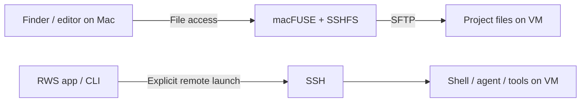

# RWS · Remote Workspace System

**Browse remote project files in Finder. Run development tools on their remote host.**

RWS combines a native macOS app, a Rust CLI and SSH. Your remote machine remains
where the files live and where explicitly launched commands execute.

[Get started](docs/install.md) · [Build from source](docs/development.md) ·
[Architecture](docs/architecture.md) · [Documentation](docs/README.md) ·
[Feature backlog](https://github.com/ssime-git/RWS/issues/1)

> **Development preview.** The app and CLI work on the tested Mac/SSH setup.
> There is no published signed release yet. Mounting currently requires macFUSE
> and an external experimental SSHFS build. Installation on a clean Mac and
> failure recovery are not fully validated. See [tested scope](docs/validation.md).

## Choose your starting point

| You want to… | Start here |
| --- | --- |
| Open an existing `RWS.app` by double-clicking | [App user guide](docs/install.md#1-get-the-app) |
| Download a development build without compiling RWS | [Build availability](docs/install.md#build-availability) |
| Compile, test and run the app yourself | [Developer quick start](docs/development.md) |
| Use only the command line | [CLI guide](docs/prototype.md) |
| Keep configured mounts across macOS restarts | [Persistent mounts](docs/install.md#durable-macos-installation) |
| Understand which processes run where | [Conceptual architecture](docs/architecture.md) |
| Fix a connection, mounting or Finder problem | [Troubleshooting](docs/troubleshooting.md) |

## How it works today



**Files and execution are separate paths.** macFUSE handles filesystem operations;
it does not redirect arbitrary Mac processes. A normal terminal opened inside
`/Volumes/RWS-demo` still runs locally. Use **Lancer sur la VM** in the app, or
`rws agent`, `rws exec` or `rws shell`, for remote execution today.

The original product goal is broader: working in a mounted project should run its
commands on the VM naturally, including Delta without special agent instructions
where feasible. **That transparent execution is not implemented.** It is tracked
in [#1](https://github.com/ssime-git/RWS/issues/1),
[Delta #2](https://github.com/ssime-git/RWS/issues/2) and
[terminals #3](https://github.com/ssime-git/RWS/issues/3).

## A first session

Once the [prerequisites](docs/install.md#2-prepare-the-mac-and-the-remote-host) are ready:

1. Double-click **RWS.app**. Review the detected configuration and dependency status.
2. Save the SSHFS path and FSKit setting in **Configuration avancée** on first use,
   then add an SSH destination and absolute remote folder, or select an existing space.
3. Click **Ouvrir dans le Finder** to connect and browse. RWS also attempts to pin
   the volume in Finder; if that fails, it explains the manual fallback.
4. Enter a remotely installed CLI such as `claude` or `codex`, then choose
   **Lancer sur la VM**. The terminal shows the remote host, OS and directory.
5. Close files using the mount and choose **Déconnecter** when finished.

No agent whitelist is required: the launcher accepts a remote executable name or
absolute path. The agent and its authentication must already be set up on the VM.
An editor extension without a CLI needs its own integration.

## What is available

| Available now | Not yet delivered |
| --- | --- |
| Native macOS app; register/connect/disconnect spaces | Automatic switch for non-zsh shells, scripts and IDE-internal processes |
| Opt-in zsh hook: `cd` into a verified mount opens the remote shell | |
| Generic remote agent launcher and explicit SSH commands | General redirection of Delta's native processes |
| Config/dependency discovery and actionable errors | One-step clean-Mac dependency installation |
| Finder pinning with bookmark renewal and manual fallback | Sessions surviving disconnects and cross-device reattachment |
| Build CI, local bundle replacement and release pipeline | Signed public release and validated user auto-updates |

The existing Delta integration uses personal agent instructions. A tested Delta
workflow is available in the [Delta guide](docs/connection.md#delta-and-linux-commands);
it is not equivalent to native remote execution without instructions.

### Persistent mounts on macOS

After a configuration and its mounts work interactively, `rws install` copies
RWS, the selected SSHFS build, and the configuration into the user's Application
Support directory. `rws autostart install` then creates one LaunchAgent that
attempts every configured workspace at login. This keeps restart recovery out of
the source checkout; see the [durable-install procedure](docs/install.md#durable-macos-installation).

## Build the app

On an Apple silicon Mac with [Rust, Xcode and Python 3 ready](docs/development.md#prerequisites):

```sh
git clone --branch prototype/cli https://github.com/ssime-git/RWS.git
cd RWS
rustup target add aarch64-apple-darwin
scripts/build-macos-app.sh development
open dist/development/RWS.app
```

The builder includes the RWS CLI and Sparkle framework. macFUSE and SSHFS are
separate prerequisites for mounting. Quit RWS before rebuilding; the previous
bundle is archived as ZIP and the new build replaces the same path.

## Explore and contribute

- [Documentation map](docs/README.md): user, developer, maintainer and reference guides.
- [Architecture](docs/architecture.md): components, data flow and trust boundaries.
- [Features and linked issues](FEATURES.md): gaps, priorities and acceptance criteria.
- [Roadmap](ROADMAP.md): delivery order, distinct from current capabilities.
- [Contributing](CONTRIBUTING.md): tests, review expectations and private-data rules.

**License selection is pending.** Source availability is not a declared open-source
license. No project license is implied; choose and publish one before distributing
RWS as a licensed open-source release. Third-party components retain their own terms.
