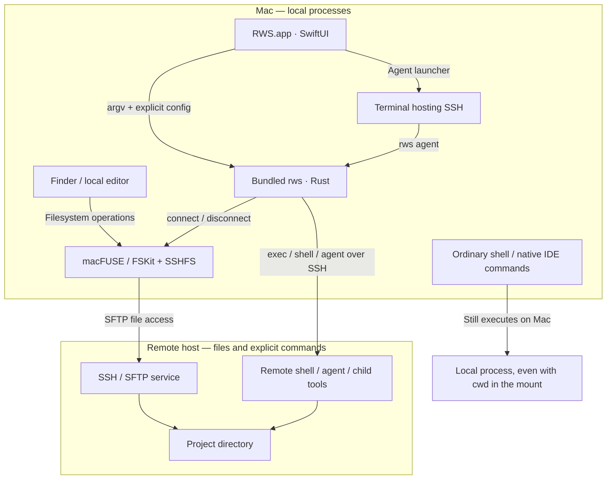
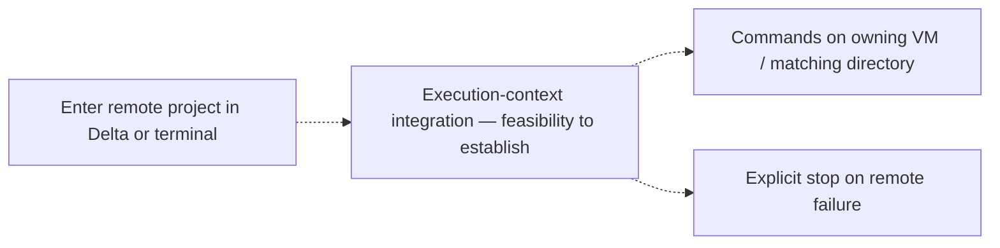

# Architecture: current system and target experience

[Documentation](README.md) · [Build from source](development.md) · [Feature backlog](../FEATURES.md)

RWS currently connects two separate capabilities: **access to remote files** and
**explicit remote process execution**. Understanding that boundary is essential
to using and extending the system correctly.

## 1. Where things run today



A file path inside `/Volumes/RWS-demo` determines which filesystem receives an
operation. It does not determine where the calling process runs. macFUSE forwards
[file operations](https://macfuse.github.io/), not arbitrary executable launches.

For a remote agent launched through RWS, the terminal window is local but SSH
starts the shell/agent on the configured host. Its child tools execute there,
subject to that agent's own configuration and any explicit connections it makes.
RWS does not copy local credentials or install a remote daemon.

## 2. Connecting and browsing

```mermaid
sequenceDiagram
    actor User
    participant App as RWS app
    participant CLI as Rust CLI
    participant FS as SSHFS / macFUSE
    participant VM as SSH host
    participant Finder
    User->>App: Open in Finder
    App->>CLI: connect workspace
    CLI->>FS: Start or verify mount
    FS->>VM: SFTP connection
    CLI->>VM: Verify destination with disposable proof file
    CLI-->>App: Verified mount or explicit error
    App->>Finder: Renew favorite and open mounted path
    Note over App,Finder: Pinning failure is reported separately; manual fallback is available
    User->>App: Disconnect
    App->>CLI: Normal unmount
    CLI-->>App: Success or busy/error
    App->>Finder: Remove managed favorite after success
```

Config writes use locking and atomic replacement. Mount receipts distinguish a
verified RWS destination from an unrelated filesystem at the same path. Verification
requires a writable remote root. An existing unrecognized mount is not silently
adopted; see [connection identity](connection.md#existing-mounts-and-verification).

Finder bookmarks bind to filesystem identity. Reusing just the path after an FSKit
remount can leave a stale favorite. The app removes its matching entry and creates
a fresh bookmark, preserving unrelated favorites. This uses a deprecated macOS
shared-list API behind a small native bridge, so errors remain visible and a manual
fallback is documented. The CLI alone does not manage Finder favorites.

## 3. Explicit remote execution

| Entry point | Route | Current working directory |
| --- | --- | --- |
| App **Lancer sur la VM** | Private launcher → Terminal → `rws agent` → SSH | Selected remote workspace root |
| `rws exec --workspace demo -- …` | Literal argv → quoted remote command → SSH | Remote workspace root |
| `rws exec --cwd … --git-context -- …` | Verified path and Git mapping → SSH | Corresponding remote directory |
| `rws shell` | SSH PTY → remote login shell | Mapped current directory, or explicit workspace root |
| Current Delta rules | Agent instructed to invoke RWS explicitly | Mapped checkout; native Delta processes remain local |
| Interactive zsh with `eval "$(rws hook zsh)"` | `cd` into verified mount → `rws context` check → `[Y/n]` prompt (answer kept per shell) → `rws shell` over SSH | Mapped remote directory |
| Ordinary terminal without the hook `cd /Volumes/RWS-demo` | No RWS execution integration | Local shell in a remotely backed filesystem |

`rws agent` loads the remote login environment before changing to the remote
workspace and starting the requested executable. This matters for user-installed
agent CLIs outside SSH's default noninteractive PATH. Arguments are quoted as
literals. Failed SSH or a missing remote executable does not trigger local fallback.
Remote shell support currently assumes POSIX-compatible login-shell semantics.

The [Delta workflow](connection.md#delta-and-linux-commands) is a convention followed
by the agent. It is not enforcement for every terminal, Git helper, preparation
step or subprocess created by Delta.

## 4. Code map

| Component | Responsibility |
| --- | --- |
| [`src/config.rs`](../src/config.rs), [`workspace.rs`](../src/workspace.rs) | Workspace schema, validation, path ownership |
| [`src/routing.rs`](../src/routing.rs) | Directory and same-workspace Git-context mapping |
| [`src/transport.rs`](../src/transport.rs) | Remote quoting, shell/agent command construction, bounded diagnostics |
| [`src/main.rs`](../src/main.rs) | CLI commands, SSH invocation, lifecycle orchestration |
| [`src/mount.rs`](../src/mount.rs), [`lifecycle.rs`](../src/lifecycle.rs) | Mount process handling, identity and recorded state |
| [`src/agent_rules.rs`](../src/agent_rules.rs) | Current instruction-based Delta integration |
| [`AppModel.swift`](../macos/Sources/RWSApp/AppModel.swift) | UI state, config discovery, command coordination |
| [`ProcessRunner.swift`](../macos/Sources/RWSApp/ProcessRunner.swift) | Bounded output/deadlines for app-launched CLI operations |
| [`AgentLauncher.swift`](../macos/Sources/RWSApp/AgentLauncher.swift) | Quoted private launcher for an explicit remote agent |
| [`FinderSidebar.swift`](../macos/Sources/RWSApp/FinderSidebar.swift) | Scoped bookmark replacement/removal |
| [`UpdateManager.swift`](../macos/Sources/RWSApp/UpdateManager.swift) | Production update checks and mount-state installation guard |
| [`scripts/`](../scripts/) | Dependency build, bundle publication, signing and release tooling |

## 5. State and boundaries

| Location | Contents | Distribution policy |
| --- | --- | --- |
| `RWS.app` | GUI, bundled `rws`, Sparkle, build metadata | Replaceable bundle; no personal configuration inside |
| `~/Library/Application Support/RWS/config.json` | Default personal workspace/settings file | Preserve across updates |
| Selected external `config.json` | Existing configuration reused in place | Do not move it casually; discovery remembers its path |
| State beside configuration | Receipts and diagnostic mount logs | Private; logs can expose hosts and paths |
| `~/Library/Application Support/RWS/AgentLaunchers/` | Quoted `.command` launchers | Private local files, no embedded credentials |
| `.rws-local/` | Developer configuration, patched dependency, private evidence | Git-ignored, never a public sample |
| `dist/` | Current build and ZIP archives | Build output, Git-ignored |

SSH host-key verification and user authentication remain with OpenSSH. RWS does
not weaken them. Authentication must work without a mount-time password prompt.
Remote services and files retain their remote access controls. macFUSE/SSHFS are
external runtime dependencies and are not updated by Sparkle.

## 6. Target architecture — not implemented



Dashed arrows are the **desired product**, not a shipped redirection mechanism.
The integration must cover each actual command-creation path and distinguish
local UI processes from project execution. A zsh hook alone cannot establish
coverage of an IDE's noninteractive or native subprocesses.

- [Architecture feasibility #1](https://github.com/ssime-git/RWS/issues/1).
- [Delta without special instructions #2](https://github.com/ssime-git/RWS/issues/2).
- [Automatic terminal context #3](https://github.com/ssime-git/RWS/issues/3).
- [Exact path/worktree context #4](https://github.com/ssime-git/RWS/issues/4).
- [No accidental local fallback #5](https://github.com/ssime-git/RWS/issues/5).

A limitation must be demonstrated and brought back as a product decision. The
explicit launchers cannot be silently substituted for this goal.

## 7. Evidence and limitations

The [validation journal](validation.md) records real file operations, a Finder
remount/click cycle, agent process startup and a Delta forwarding diagnostic.
These do not establish clean-Mac setup, every editor save pattern, network-loss
recovery, authenticated model inference, or a signed update between two releases.
Persistent sessions and mobile/other desktop clients remain roadmap work.
